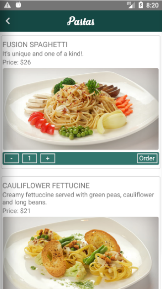
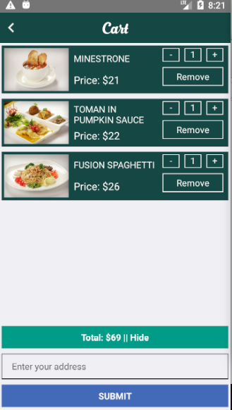
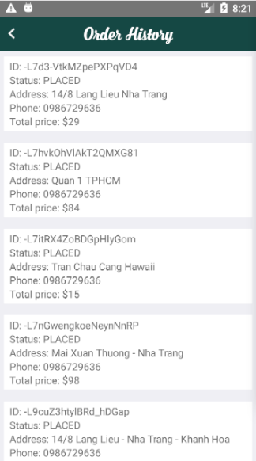

# Installation
 1. Clone project: https://github.com/batru96/OrderFood_ReactNative.git
 2. Install the dependencies and run the application.
    ```sh
    $ cd order-food
    $ npm install
    $ react-native run-android
    ```
# Screenshot
- ### Menu
  
- ### Product
  
- ### Cart
  
- ### Order history
  
- ### Change - save phone number
